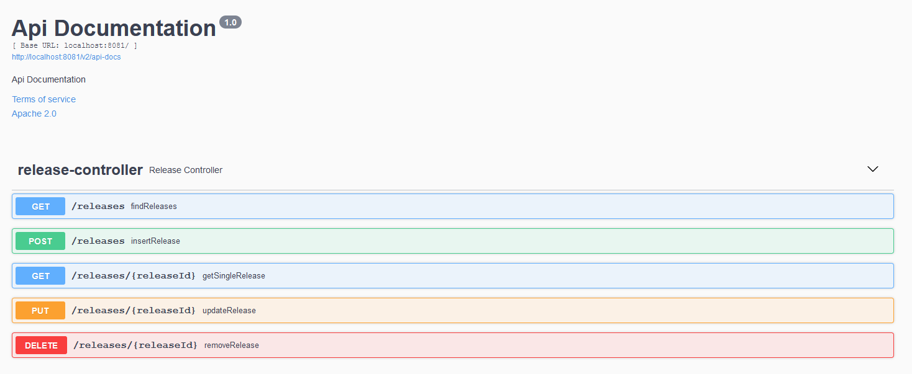
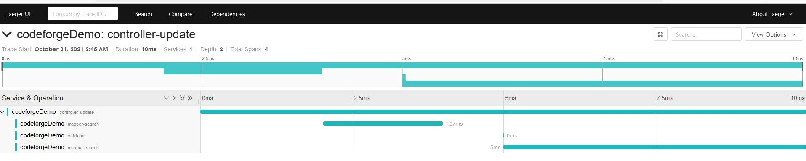

# Release tracker demo

### Introduction & Setup
This project was created as part of the coding assignment. The goal of the project is to create 
a simple Spring Boot application that manages software releases. The application needs to expose several 
API endpoints that will allow the user to manage the releases. 

The application uses [PostgreSQL](https://www.postgresql.org/) as the database. Before you start, you will need to create the database 
and update the connection string and other database properties in the `application.settings` file. I won't 
cover database setup here, but I will provide the SQL needed to create the database once you have installed 
PostgreSQL on your machine. Here is the SQL script:

```
CREATE DATABASE codeforge
    WITH 
    OWNER = postgres
    ENCODING = 'UTF8'
    LC_COLLATE = 'English_United States.1252'
    LC_CTYPE = 'English_United States.1252'
    TABLESPACE = pg_default
    CONNECTION LIMIT = -1;

CREATE TABLE IF NOT EXISTS public.release
(
    name character varying COLLATE pg_catalog."default" NOT NULL,
    description character varying COLLATE pg_catalog."default",
    id integer NOT NULL GENERATED ALWAYS AS IDENTITY ( INCREMENT 1 START 1 MINVALUE 1 MAXVALUE 2147483647 CACHE 1 ),
    "createdAt" timestamp without time zone DEFAULT CURRENT_TIMESTAMP,
    "lastUpdateAt" timestamp without time zone,
    status character varying COLLATE pg_catalog."default",
    "releaseDate" date,
    CONSTRAINT id_pk PRIMARY KEY (id)
        INCLUDE(id)
)

TABLESPACE pg_default;

ALTER TABLE public.release
    OWNER to postgres;
```
Once you have the database created, you need to update your database properties in `application.settings` file:
```
spring.datasource.url = jdbc:postgresql://localhost:5432/codeforge
spring.datasource.username = postgres
spring.datasource.password = YOUR_DB_PWD
spring.datasource.driver-class-name =org.postgresql.Driver
```
Of course, `spring.datasource.url` will point out to the database on your machine (or you can target a remote 
machine, or even a Docker container). Password will be the same as the one that you have chosen during the 
Postgres setup.

### Swagger documentation

The application implements Swagger and exposes Swagger UI. I kept it pretty basic for the purpose of this example. 
On the picture below, you can see the list of endpoints that the application exposes: 



### Jaeger-tracing support

Many projects I've worked on during the past few years, were parts of the microservice ecosystem - so having all 
relevant data about what's going on between (and inside) these services is extremely important if you want to 
have proper maintenance and quick reaction to production issues, but also if you care about the performance and 
want to remove bottlenecks in your applications. This is where tracing tools come in. Most powerful one I've used was 
probably Datadog, but for this example I've decided to use [Jaeger-Tracing](https://www.jaegertracing.io/). It is 
pretty easy to set up, but it requires a bit of manual work in order to properly wrap your code in spans. **NOTE**: the 
example that you see here is a basic one that is good for showcasing the general concept - but there is a better 
way of doing it. 

After you install Maven dependencies and create your spans, you need to have Jaeger docker container running on your 
machine. The container can be started using the following command:
```
docker run --rm -p 6831:6831/udp -p 6832:6832/udp -p 16686:16686 jaegertracing/all-in-one:1.7 --log-level=debug
```
This will result in having the Jaeger UI on [http://localhost:16686/](http://localhost:16686/). With this UI up and 
running and with your application ready, all you need to do is to start your application ad fire up a few requests. 
Once you look back at the Jaeger UI, you should be able to see each of these requests in detail:



For example, on this picture, we see how long each part of the update request took, for every method/component 
that was involved.

### Raygun support

### Potential improvements
