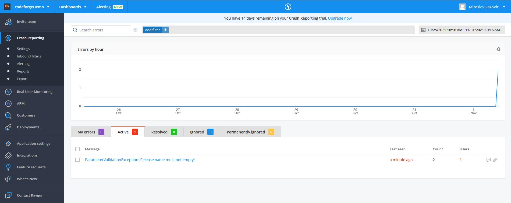
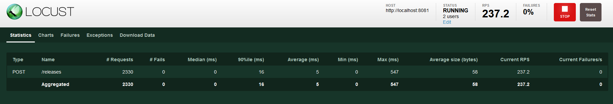
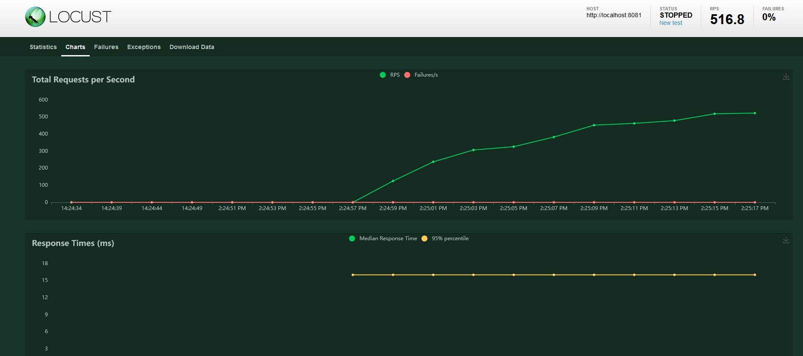

# Release tracker demo

### Introduction & Setup
This project was created as part of the coding assignment. The goal of the project is to create 
a simple Spring Boot application that manages software releases. The application needs to expose several 
API endpoints that will allow the user to manage the releases. 

The application uses [PostgreSQL](https://www.postgresql.org/) as the database. Before you start, you will need to create the database 
and update the connection string and other database properties in the `application.properties` file. I won't 
cover database setup here, but I will provide the SQL needed to create the database once you have installed 
PostgreSQL on your machine. Here is the SQL script:

```
CREATE DATABASE codeforge
    WITH 
    OWNER = postgres
    ENCODING = 'UTF8'
    LC_COLLATE = 'English_United States.1252'
    LC_CTYPE = 'English_United States.1252'
    TABLESPACE = pg_default
    CONNECTION LIMIT = -1;

CREATE TABLE IF NOT EXISTS public.release
(
    name character varying COLLATE pg_catalog."default" NOT NULL,
    description character varying COLLATE pg_catalog."default",
    id integer NOT NULL GENERATED ALWAYS AS IDENTITY ( INCREMENT 1 START 1 MINVALUE 1 MAXVALUE 2147483647 CACHE 1 ),
    "createdAt" timestamp without time zone DEFAULT CURRENT_TIMESTAMP,
    "lastUpdateAt" timestamp without time zone,
    status character varying COLLATE pg_catalog."default",
    "releaseDate" date,
    CONSTRAINT id_pk PRIMARY KEY (id)
        INCLUDE(id)
)

TABLESPACE pg_default;

ALTER TABLE public.release
    OWNER to postgres;
```
Once you have the database created, you need to update your database properties in `application.settings` file:
```
spring.datasource.url=jdbc:postgresql://localhost:5432/codeforge
spring.datasource.username=postgres
spring.datasource.password=YOUR_DB_PWD
spring.datasource.driver-class-name=org.postgresql.Driver
```
Of course, `spring.datasource.url` will point out to the database on your machine (or you can target a remote 
machine, or even a Docker container). Password will be the same as the one that you have chosen during the 
Postgres setup.

### Implementation details and general notes on project

One of the main reasons why I have chosen MyBatis over something else is that MyBatis forces a SQL-first approach, 
which not only gives you more control over the SQL query that you are writing, but also makes it easy for you to 
test that SQL query individually. This is something which may not be the case with ORMs. That doesn't mean that ORMs 
are bad - however it does mean that over-relying on ORM can distance a developer from the SQL and the database level-decisions. 
It may also lead to various issues when it comes to optimizing your SQL queries, because sometimes it can lead to a 
situation where are not sure what you are optimizing: usage of ORM or an SQL query. As a general rule, I think that 
complex queries should always be properly tested and reviewed (especially if you have DB devs in your team), which means 
that you have to have as much control as possible over them. MyBatis enables you to do just that in most cases (and modifying 
query to conform to MyBatis format is usually trivial).

Speaking of testing, the tests I have written for the service (besides the unit ones, for validators) are actually 
integration-like tests because they do require the database to be set up (meaning they are testing the whole thing, no 
mocking involved). I have done this because I wanted to look at the application as a "black box" and see how it responds 
to various requests. However, while this may be sufficient in the scope of this demo (due to the small size of the project) 
it may not be the best way to go on the real-world project. I would probably move integration tests to a completely separated 
test suite, maybe even written in another language. Regarding the tests here, they would have to change and I would use mocks 
in order to simulate the behaviour of the dependencies. 

Speaking o mocks, one of the things I've used here is constructor-level injection, since this makes mocking much easier. 
Writing tests can become increasingly hard if you have multiple @Autowired beans and this technique can really help here.

### Swagger documentation

The application implements Swagger and exposes Swagger UI. I kept it pretty basic for the purpose of this example. 
On the picture below, you can see the list of endpoints that the application exposes: 


### Jaeger-tracing support

Many projects I've worked on during the past few years, were parts of the microservice ecosystem - so having all 
relevant data about what's going on between (and inside) these services is extremely important if you want to 
have proper maintenance and quick reaction to production issues, but also if you care about the performance and 
want to remove bottlenecks in your applications. This is where tracing tools come in. Most powerful one I've used was 
probably Datadog, but for this example I've decided to use [Jaeger-Tracing](https://www.jaegertracing.io/). It is 
pretty easy to set up, but it requires a bit of manual work in order to properly wrap your code in spans. **NOTE**: the 
example that you see here is a basic one that is good for showcasing the general concept - but there is a better 
way of doing it. 

After you install Maven dependencies and create your spans, you need to have Jaeger docker container running on your 
machine. The container can be started using the following command:
```
docker run --rm -p 6831:6831/udp -p 6832:6832/udp -p 16686:16686 jaegertracing/all-in-one:1.7 --log-level=debug
```
This will result in having the Jaeger UI on [http://localhost:16686/](http://localhost:16686/). With this UI up and 
running and with your application ready, all you need to do is to start your application ad fire up a few requests. 
Once you look back at the Jaeger UI, you should be able to see each of these requests in detail:


For example, on this picture, we see how long each part of the update request took, for every method/component 
that was involved. This way, we can spot issues (for example, the operations that take too much time to complete). In 
the same time, it is worth noting that there are benefits of having tracing implemented even in monoliths/single services,
because there are still benefits to having detailed information about what is going on inside your application.

### Raygun support

The application also implements [Raygun](https://raygun.com/) for crash reporting. Raygun provides much more than crash 
reporting, but I wanted to showcase that particular feature. When maintaining the application in production, it is 
very important to have timely updates whenever something bad happens. With Raygun (or similar tools), you can be notified 
whenever an exception is thrown (via Slack integration, email or something else). Not only that, but you also have a nice 
dashboard that you can use to manage and track all your exceptions:



In order to use Raygun, you need to have it enabled, and you also have to create an account ad paste your client ID 
to the corresponding `application.properties` flags:
````
raygun.enabled=false
raygun.clientId=YOUR_RAYGUN_ID
````
To enable Raygun. simply set `raygun.enabled` property to `true` and replace the placeholder string for the client ID 
with your Raygun client ID. 

### Load testing with Locust

In many cases, it is very important to benchmark your application get the sense of what are its limits. Load testing can 
be particularly helpful here, because with the right tools, you can simulate many users in real-world scenarios and look 
for stability or performance issues. This is especially important for applications that will be used by large number of 
users every single day. One of the tools that can help you with this is Locust, which is a Python tool. I know a bit of 
Python and I've used Locust on some other projects, so I found it to be a very nice tool for this particular use case. 

Included in the project is a sample script, called `locust.py`, that can be started in order to simulate a request
(inserting release data in this case). To start it, you need to have Python and Locust installed and run the following 
command in the folder where the Locust file is located:
```
locust -f locustfile.py --host=http://localhost:8081
```
Of course, you need to have your application already up and running (in this case on port 8081). The Locust UI 
will be available on `http://localhost:8089` and you will need to type the number of users and spawn rate. After that, 
when the test starts, you should be able to see the stats:





My opinion is that tools such as this one are very good for integration testing, where you inspect the behaviour of the 
system as a whole. 

### Potential improvements

There are several things that I would consider a good improvement:

- Changing the response code of the endpoint that handles the insertion of objects to `201 CREATED` and returning an id 
of the created object with it. I actually tried to do that using RETURNING statement that PostgreSQL implements, but 
unfortunately, I could not make it work with MyBatis (I probably missed something in the setup).
- Adding more unit tests for the Controller and Service levels
- Creating a Docker container for the whole project
- Add a few Spring profiles (I've used those in the past and they are great for separating your configuration for 
different environments)